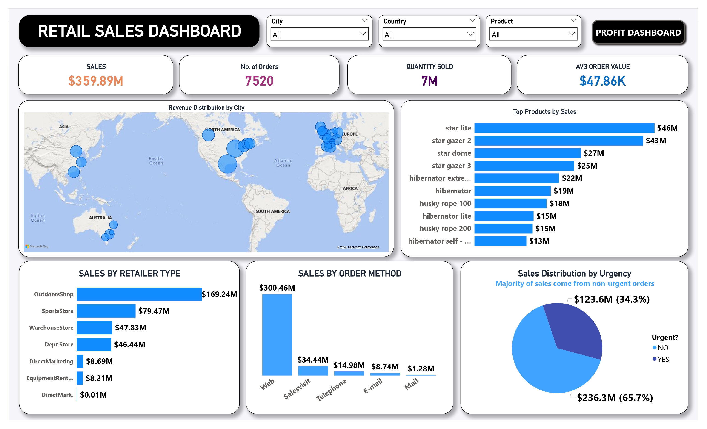

📊 Global Retail & Profitability Intelligence Dashboard
📌 Overview

This project presents a dual-dashboard Power BI solution designed to analyze global retail performance across 7,520 orders and $359.89M in total revenue.

The dashboard bridges the gap between sales performance (top-line growth) and profitability (bottom-line impact), enabling data-driven decision-making across products, regions, and sales channels.

🖼️ Dashboard Preview
📄 Retail Sales Dashboard

📄 Profitability Dashboard

📈 Key Business Metrics
Metric	Value
    Total Revenue	$359.89M
    Total Profit	$134.66M
    Total Cost	$225.24M
    Profit Margin	37.42%
    Average Order Value	$47.86K
    Avg Profit per Order	17.91K
    Total Orders	7,520
    Quantity Sold	7M Units

🧠 Problem Statement

  Retail organizations often struggle to:

  Identify high-profit vs high-volume products
  Understand true profitability across channels
  Evaluate operational efficiency (urgent vs non-urgent orders)
  Make decisions based on fragmented or unclean data

💡 Solution

  This dashboard provides:

  A unified view of sales and profitability
  Clear distinction between revenue and profit drivers
  Interactive analysis across products, channels, and geographies
  Operational insights into order urgency and logistics efficiency

🧩 Dashboard Architecture
  🔹 1. Retail Sales Analysis

  Focuses on revenue generation and market performance

  🌍 Revenue distribution by city (global map)
  📦 Top products by sales
  🏬 Sales by retailer type
  🌐 Sales by order method
  ⏱️ Sales distribution by urgency

  Highlights:

  Star Lite leads with $46M in sales
  Web channel dominates with $300.46M
  OutdoorsShop contributes $169.24M revenue

🔹 2. Profitability Intelligence

  Focuses on financial performance and efficiency

  💰 Total profit, cost, and margin KPIs
  📊 Profit by product
  🏬 Profit by retailer type
  📉 Revenue vs cost comparison
  🌍 Profit distribution by city
  ⚙️ Profit by urgency

  Highlights:

  OutdoorsShop contributes 49.7% of total profit
  Non-urgent orders generate $88M profit vs $46M urgent
  Profit margin stands at 37.42%
  🛠️ Data Cleaning & Transformation (ETL)

  Before visualization, the dataset underwent a rigorous ETL process using Power Query:

🔧 Key Transformations
  Handling Missing Values
  Cleaned null values in RetailerType and Order Method to avoid misclassification
  Data Type Standardization
  Converted financial fields into structured currency formats for accurate DAX calculations
  Logical Deduplication
  Verified all 7,520 orders to ensure uniqueness and eliminate duplicate transactions
  Attribute Parsing
  Cleaned product strings (e.g., “hibernator self - inf...”) into standardized product names
  Geography Mapping
  Standardized city and country names for accurate map visualization
  Feature Engineering
  Created a binary Urgency flag (Yes/No) to analyze operational efficiency

📊 Key Insights
🔹 Channel Performance
    OutdoorsShop is the top profit contributor (49.7%)
    Not just a sales leader, but a profit driver
🔹 Product Strategy
    High sales ≠ high profit
    Some products generate better margins despite lower volume
🔹 Operational Efficiency
    Non-urgent orders generate higher profit
    Suggests optimization opportunity in standard delivery over express logistics
🔹 Geographic Trends
    Revenue and profit are concentrated in North America and Europe
    Emerging patterns in Asia and Australia markets

🎯 Business Impact

This dashboard enables:

  ✔ Identification of high-profit products
  ✔ Optimization of sales channels
  ✔ Improved logistics and operational decisions
  ✔ Faster data-driven decision-making
  ✔ Reduced dependency on manual reporting

🚀 Future Enhancements
  📅 Time-series analysis (monthly/seasonal trends)
  🤖 Forecasting (sales & profit prediction)
  👥 Customer segmentation
  📦 Inventory optimization
  💰 Pricing strategy analysis
  🔍 Drill-through product-level analysis
🛠️ Tools & Technologies
  Power BI
  DAX (Data Analysis Expressions)
  Power Query (ETL)
  Data Modeling

🧠 Skills Demonstrated
  Data Cleaning & ETL
  Data Modeling
  Dashboard Design (UI/UX)
  Business Analysis
  KPI Development
  Financial Analytics

📌 Conclusion

This project demonstrates how combining clean data, strong modeling, and business-focused visualization can transform raw numbers into actionable insights.

“Revenue tells you what happened. Profit tells you what it meant.”
